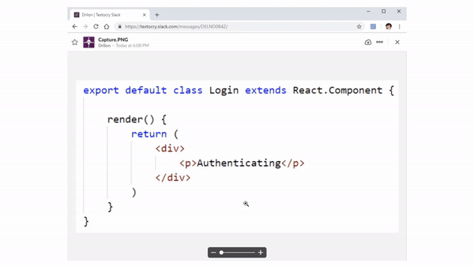

# NotesSnap - copy text from images

NotesSnap is a chrome extension to copy text from images using the best open source OCR engine [Tesseract.js](https://github.com/naptha/tesseract.js) and save it to the database, allowing the user to edit there notes(extrcted text) from NotesSnap Editor.

- Video format - youtube, any tutorial platform
- Image format - images on internet

In every instance you need to write it down character by character.
Using Textocry you can just select the area with the text and let Tesseract extract the text, as shown below.



## Using NotesSnap Extension

Install it in the browser by loading the package in the app

1. Click the icon .
2. Crop the area containing the text.
   **Wait until Tesseract recognizes the text... and done!**
3. The text is in your clipboard. `Ctrl + V` to paste it!

## Building NotesSnap

Once you clone the codebase in the root directory execute:

```bash
$ npm install
$ npm run webpack
```

Webpack will bundle the Javascript files into `./dist/main.js` which will be used as starting point for the extension.

### Loading NotesSnap into the browser

1. Enter in the Address bar `chrome://extensions`.
2. Click `Load unpacked` and select the root folder.

Done!

## Credits

This tool is build with help of:

- [@rinormaloku](https://github.com/rinormaloku) for creating [Textocry](https://github.com/rinormaloku/textocry)
- Tesseract.js - does the actual OCR:
- @simo - creater of the [Screenshot Capture](https://github.com/simov/screenshot-capture) extension, used as a starting point
